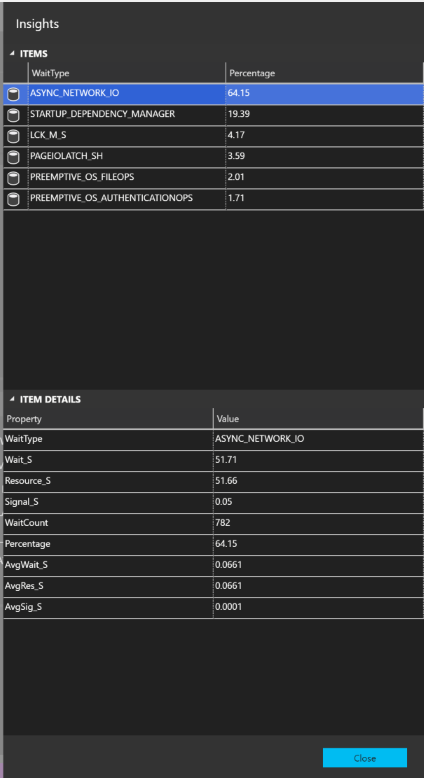

# MSSQL-Instance-Insights widget

This collection of widgets are designed to provide insights into MSSQL Instance to further extend the built-in default widgets.

Where possible all of these widgets will include more detail when you click *_Show Details_* from the widget menu.


## Installation

The current release will be available through the Extensions Marketplace in Sql Ops Studio.

Current and Pre-releases will be available from the [Releases](https://github.com/Matticusau/sqlops-mssql-instance-insights/releases) tab of the projects repository. Simply download the VSIX of the release you want, and use the ***Install Extension from VSIX Package*** option in Sql Ops Studio.

## Supported SQL Server Versions

These widgets have been tested against the following SQL Server versions:

* SQL Server 2016
* SQL Server 2017 (Windows & linux)

If you find any issues using these widgets on these supported SQL Server versions, or any other versions please create an issue as we would like to make these available for as many releases as possible.

***We are looking for testers to confirm other environments.*** So if you find they do work on other releases let me know, and credit will be given.

## Dashboard Tab

When the extension is loaded it will add a Dashboard tab. You can edit your workspace settings in the *dashboard.server.tabs* section to include this on your specific projects.


## mssql-instance-waits

This Server Dashboard widget includes information on the top 10 waits for the SQL Instance. Information will be shown in the form of a bar chart.


You can access more information about the waits in the detailed fly-out displayed when you select "..." on the widget.



Credit for the query this widget is based on goes to [Paul Randal - Tell me where it hurts](https://www.sqlskills.com/blogs/paul/wait-statistics-or-please-tell-me-where-it-hurts/)

To enable this widget add the following json to either your user or workspace settings in the *dashboard.server.widgets* section.

```json
{
    "widget": {
        "mssql-instance-waits.insight": {
            "cacheId": "1d7cba8b-c87a-4bcc-ae54-2f40a5503a90"
        }
    }
}
```

## mssql-instance-vlfs

This Server Dashboard widget includes information on the number of VLfs per database in the SQL Instance. Information will be shown in the form of a bar chart.

This insight is ***not*** supported on Azure SQL Db.


You can access more information about the vlfs in the detailed fly-out displayed when you select "..." on the widget.


To enable this widget add the following json to either your user or workspace settings in the *dashboard.server.widgets* section.

```json
{
    "widget": {
        "mssql-instance-vlfs.insight": {
            "cacheId": "1d7cba8b-c87a-4bcc-ae54-2f40a5503a90"
        }
    }
}
```

## mssql-instance-xelsystem

This Server Dashboard widget includes information on the general system performance captured by the Extended Events System Health Session for the SQL Instance. Information will be shown in the form of a line chart. If the System Health Session is stopped or the instance has been restarted will affect the amount of data available for this widget.


You can access more information in the detailed fly-out displayed when you select "..." on the widget.


Credit for the query this widget is based on goes to [troubleshootingsql.com](https://troubleshootingsql.com/2013/08/02/powerview-and-system-health-session-system/)

> This widget is not currently supported on *_Azure SQL DB_* due to lack of support for Extended Events.

To enable this widget add the following json to either your user or workspace settings in the *dashboard.server.widgets* section.

```json
{
    "widget": {
        "mssql-instance-xelsystem.insight": {
            "cacheId": "1d7cba8b-c87a-4bcc-ae54-2f40a5503a90"
        }
    }
}
```

## mssql-instance-xelio

This Server Dashboard widget includes information on the IO performance captured by the Extended Events System Health Session for the SQL Instance. Information will be shown in the form of a line chart. If the System Health Session is stopped or the instance has been restarted will affect the amount of data available for this widget.


You can access more information in the detailed fly-out displayed when you select "..." on the widget.


Credit for the query this widget is based on goes to [troubleshootingsql.com](https://troubleshootingsql.com/2013/07/25/powerview-and-system-health-session-io-health/)

> This widget is not currently supported on *_Azure SQL DB_* due to lack of support for Extended Events.

To enable this widget add the following json to either your user or workspace settings in the *dashboard.server.widgets* section.

```json
{
    "widget": {
        "mssql-instance-xelio.insight": {
            "cacheId": "1d7cba8b-c87a-4bcc-ae54-2f40a5503a90"
        }
    }
}
```

## mssql-instance-xelmemory

This Server Dashboard widget includes information on the Memory performance captured by the Extended Events System Health Session for the SQL Instance. Information will be shown in the form of a line chart. If the System Health Session is stopped or the instance has been restarted will affect the amount of data available for this widget.


You can access more information in the detailed fly-out displayed when you select "..." on the widget.


Credit for the query this widget is based on goes to [troubleshootingsql.com](https://troubleshootingsql.com/2013/07/19/powerview-and-system-health-sessionsql-memory-health/)

> This widget is not currently supported on *_Azure SQL DB_* due to lack of support for Extended Events.

To enable this widget add the following json to either your user or workspace settings in the *dashboard.server.widgets* section.

```json
{
    "widget": {
        "mssql-instance-xelmemory.insight": {
            "cacheId": "1d7cba8b-c87a-4bcc-ae54-2f40a5503a90"
        }
    }
}
```